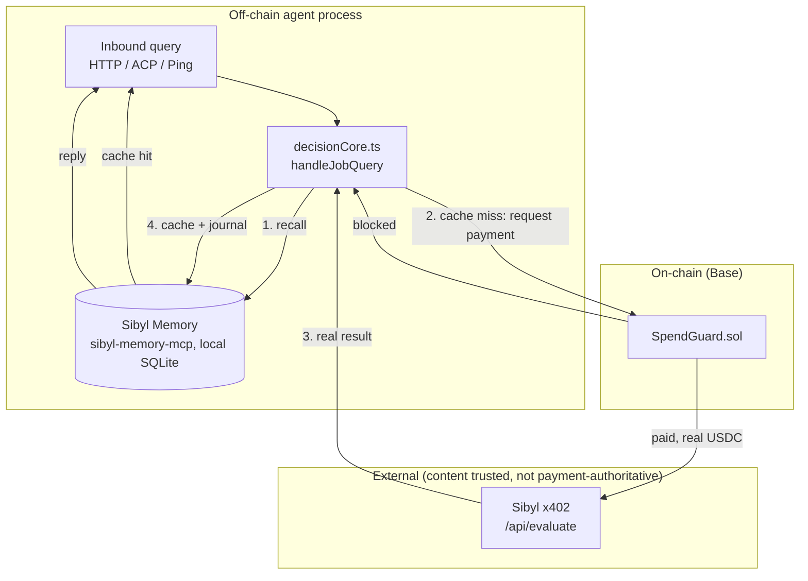
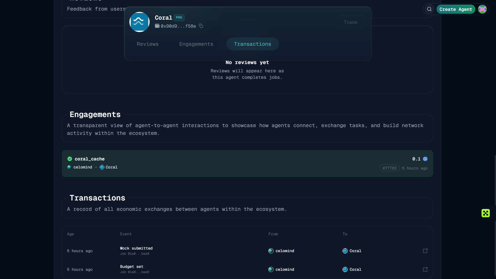

```
 ██████╗ ██████╗ ██████╗  █████╗ ██╗     
██╔════╝██╔═══██╗██╔══██╗██╔══██╗██║     
██║     ██║   ██║██████╔╝███████║██║     
██║     ██║   ██║██╔══██╗██╔══██║██║     
╚██████╗╚██████╔╝██║  ██║██║  ██║███████╗
 ╚═════╝ ╚═════╝ ╚═╝  ╚═╝╚═╝  ╚═╝╚══════╝

        on-chain agent · memory-gated payments · Base mainnet
```

# Coral

[](https://github.com/Dami904/coral/actions/workflows/ci.yml)


[](https://basescan.org/address/0xfC10f0A357c74318451A583C30A1fb5C8c7a2407)
[](https://youtu.be/7tjGCRmZ16w)

**Can you prove what it already knows, and stop it paying twice to find out?**

An agent for the Sibyl Labs Hackathon (Sep 1–10, 2026) that receives inbound
questions about a token, consults **Sibyl Memory** before ever acting, and
only pays for a fresh evaluation via Sibyl's **x402** endpoint when memory
has no cached verdict or the cached one is stale. That payment is gated by
an on-chain **`SpendGuard`** contract on Base — the agent's wallet can only
*request* a payment; the contract, not the agent's own reasoning, decides
whether it's allowed.

[Demo](#demo) · [Judge fast path](#judgereviewer-in-60-seconds) · [Core proof](#core-proof) · [What's real vs. staged](#whats-real-vs-staged)

## Demo

[](https://youtu.be/7tjGCRmZ16w)

| Time | What's happening |
|---|---|
| [0:00](https://youtu.be/7tjGCRmZ16w?t=0) | Open |
| [0:28](https://youtu.be/7tjGCRmZ16w?t=28) | The problem, on-chain |
| [0:33](https://youtu.be/7tjGCRmZ16w?t=33) | First real query — genuine cache miss, real payment |
| [0:54](https://youtu.be/7tjGCRmZ16w?t=54) | Same query again — cache hit, zero payment |
| [1:25](https://youtu.be/7tjGCRmZ16w?t=85) | Sibyl Memory deleted, live |
| [1:41](https://youtu.be/7tjGCRmZ16w?t=101) | Same query, third time — pays again, provably |
| [2:16](https://youtu.be/7tjGCRmZ16w?t=136) | A different contract (`SpendGuard` itself) — high conviction |
| [2:43](https://youtu.be/7tjGCRmZ16w?t=163) | A third contract (cbBTC) — low conviction, output genuinely varies |
| [2:54](https://youtu.be/7tjGCRmZ16w?t=174) | Verified live on Basescan |
| [3:15](https://youtu.be/7tjGCRmZ16w?t=195) | Cache-savings summary, close |

Every payment, tx hash, and tier shown is real — nothing in this recording
is a canned response. Watch the tx hash and cached tier *change* across the
three queries at 0:33/0:54/1:41 for the same contract; that's the entire
claim this project is judged on, happening in front of the camera.

## Judge/reviewer in 60 seconds

- **Live**: [free HTTP gateway](https://3-216-178-169.nip.io/health) (Base
  Sepolia today — real payments, real cache, continuously running on AWS
  EC2, not a demo recording) · [landing page](https://dami904.github.io/coral/)
  with a live "try it now" widget wired to that same gateway ·
  [technical docs](https://dami904.github.io/coral/docs.html) with every
  real transaction, mainnet and testnet, by hash.
- **The numbers**:

  | | |
  |---|---|
  | Real price per fresh Sibyl check | $0.25, confirmed live |
  | Unit tests / contract tests | 155 (vitest) / 56 (Foundry) — all passing |
  | Networks live | Base mainnet + Base Sepolia, both funded and paying |
  | Policy rules, fixed order, zero exceptions | 4 |

- **Try it in one command** (no wallet, no API key):
  ```bash
  curl "https://3-216-178-169.nip.io/check?token=0x0000000000000000000000000000000000000001"
  ```

## Table of contents

- [Core proof](#core-proof)
- [The problem](#the-problem)
- [What was built](#what-was-built)
- [Architecture](#architecture)
- [How it decides](#how-it-decides)
- [Test coverage](#test-coverage)
- [Engineering decisions](#engineering-decisions-the-why)
- [What's real vs. staged](#whats-real-vs-staged)
- [Known limitations](#known-limitations)
- [Tech stack](#tech-stack)
- [Project layout](#project-layout)
- [Setup](#setup)
- [Tests](#running-the-tests)
- [Docs](#docs)
- [Mainnet transactions](#mainnet-transactions)
- [Attribution](#attribution)
- [License](#license)

## Core proof

> Query the same never-before-seen contract three times: once cold, once
> immediately after (should be free), once again after deleting Sibyl
> Memory's SQLite file entirely (should cost real money again).

Real output, this session, unedited:

```
$ pnpm test
RUN v4.1.11
 Test Files  13 passed (13)
      Tests  155 passed (155)

$ forge test
Ran 2 test suites in 81.48ms (83.06ms CPU time): 56 tests passed, 0 failed, 0 skipped (56 total tests)
```

`test/decisionCore.test.ts`'s own words for the invariant this proves:
*"checks memory before ever calling the chain (non-negotiable invariant)."*
That's the assertion under test above — the same three-call sequence shown
in the [demo video](#demo) (0:33 / 0:54 / 1:41) is that invariant exercised
live, on the deployed contract, not just in a unit test. Coral's own real
mainnet transactions are a separate story, in
[Mainnet transactions](#mainnet-transactions) below.

## The problem

"Is this token worth looking at?" gets asked hundreds of times about the
same handful of contracts. Sibyl's `/api/evaluate` answers that for real —
builder conviction, community seed, on-chain proof of work — for a real
price, $0.25 per fresh evaluation. Paying for a fresh check on every single
ask is wasteful. Never checking is unsafe. Forgetting a verdict already
paid for, and paying again for the same answer, is worse than either — and
is exactly what happens to an agent with no memory, or one that doesn't
actually check it before spending.

No graph or traversal claims either: Sibyl's own homepage calls its memory
"graph-structured"; the shipped SDK exposes no relation-traversal API. This
build doesn't borrow that framing.

## What was built

- **A decision core** (`src/decisionCore.ts`) that checks memory before
  payment is even considered, gated by an on-chain contract, not its own
  judgment.
- **`SpendGuard`** (`contracts/SpendGuard.sol`) — a Solidity policy engine
  the agent's wallet can only request payment from, never command,
  deployed independently to Base mainnet and Base Sepolia.
- **Three ways in**: a free HTTP gateway, an ACP listing on Virtuals
  Protocol, and a Ping-based agent-to-agent gateway (built, not yet sent).

**The end-to-end loop**: a query comes in over any of the three surfaces →
`handleJobQuery` checks Sibyl Memory → a genuine miss asks `SpendGuard` →
the guard pays (or blocks, or escalates) → the real result gets cached →
every future ask for that same input is free until it goes stale.

## Architecture



| File / module | Role |
|---|---|
| [`src/decisionCore.ts`](src/decisionCore.ts) | The entire critical path — `handleJobQuery`, `handleGatewayQuery`, `resumeAfterApproval` |
| [`contracts/SpendGuard.sol`](contracts/SpendGuard.sol) | On-chain policy: allowlist, max-per-payment, budget window, rate limit, human-approval escalation |
| [`src/memory/sibylMemoryClient.ts`](src/memory/sibylMemoryClient.ts) | Sibyl Memory MCP client — the only memory backend used |
| [`src/intelligence/x402Client.ts`](src/intelligence/x402Client.ts) | Real Sibyl `directTx`/`X-PAYMENT-TX` client |
| [`src/http/httpGatewayServer.ts`](src/http/httpGatewayServer.ts) | Free `GET /check`, `/resume`, `/search` surface |
| [`src/acp/acpProvider.ts`](src/acp/acpProvider.ts) | Coral as a hireable Virtuals ACP agent |
| [`src/ping/pollOnce.ts`](src/ping/pollOnce.ts), [`pollLoop.ts`](src/ping/pollLoop.ts) | Ping poll-loop listener, built and unit-tested, not yet sending |
| [`src/gateway/incomingPaymentVerifier.ts`](src/gateway/incomingPaymentVerifier.ts) | Verifies another agent's claimed payment from the real mined receipt |

## How it decides

1. **Receive** — a query for a contract address arrives, over any surface.
2. **Recall** — Sibyl Memory is checked first, before anything else. Fresh
   hit → answer, free, no chain call.
3. **Decide** — a real miss hands the decision to `SpendGuard`. Not the
   agent's own reasoning — the contract's.
4. **Pay, cache, journal** — only once payment clears does Coral call
   Sibyl and cache the result. The payment is journaled *before* that
   call, so a downstream failure leaves a reconcilable trail, not a
   silent gap.

| Situation | Outcome |
|---|---|
| Cache hit, not stale | Answer instantly, zero payment |
| Cache miss, passes all 4 rules, ≤ threshold | Auto-pays in one step |
| Cache miss, passes all 4 rules, > threshold | Escalates — waits for a real, human-signed `ownerApprove` |
| Cache miss, fails any of the 4 rules | Blocked — no payment, reason returned |

## Test coverage

| Suite | Files | Tests | What it proves |
|---|---|---|---|
| `pnpm test` (vitest) | 13 | 155 | Decision-core invariants, memory client retry/error semantics, HTTP gateway, ACP requirement parsing, Ping poll loop, chain client retry/idempotency |
| `forge test` (Foundry) | 2 | 56 | All 4 policy rules in fixed order, every escalation/timelock/ownership boundary, ring-buffer capacity math |

Full test-by-test breakdown (every name, every file) is in the
[technical docs](https://dami904.github.io/coral/docs.html#/testing).
Nothing in the default `pnpm test`/`forge test` run touches a real network
or a real key — see [Tests](#running-the-tests) below for exactly which
mock stands in for what.

## Engineering decisions (the why)

- **Payment gating lives in a contract, not in the agent's code.** An
  agent's own reasoning can be prompt-injected, buggy, or just wrong. A
  deployed contract's rule order can't be talked out of itself.
- **`ownerApprove` skips the timelock other owner actions get.** It only
  ever acts on one specific, already-capped pending payment the agent
  proposed — it *is* the human-in-the-loop control, not a bypass of one. A
  second delay on top would double-gate the same escalation for no
  security benefit.
- **The job cache is generalized (`hiredAgentId` + `IntelligencePort`),
  Sibyl Memory is not.** The hired-agent side is architecturally ready for
  a second agent, with only Sibyl's x402 wired up today. Sibyl Memory
  isn't "generalized, one implementation so far" — it's this hackathon's
  own mandatory, judged requirement, the only memory backend Coral has
  ever used.
- **Budget/rate logs are fixed-capacity ring buffers, not unbounded
  arrays.** Every past design scanned "every payment ever" on every call;
  this one scans a constant-bounded window, sized at deploy time from the
  policy's own bounds.
- **The mainnet `humanApprovalThreshold` is set above Sibyl's real price,
  not below.** It wasn't always — the first real escalated payment lost a
  race against Sibyl's 120-second relay window because the escalation
  path's extra approval-detection step ate the whole window. Fixing the
  threshold (not the timing) closed the race for ordinary queries
  entirely. See [Known limitations](#known-limitations).

## What's real vs. staged

| Piece | Status | Detail |
|---|---|---|
| Sibyl Memory | ✅ Live | Real `sibyl-memory-mcp` over stdio, real SQLite, deletion-tested against both deployed contracts. |
| `SpendGuard`, Base mainnet | ✅ Live | Deployed, Basescan-verified, funded, paying out real USDC through a real, on-chain-executed policy. |
| `SpendGuard`, Base Sepolia | ✅ Live | Timelocked policy, fixed-capacity ring buffers, two-step ownership. |
| x402 payment, real Sibyl endpoint | ✅ Live | Real `directTx` settlement against Sibyl's production endpoint on mainnet — real USDC paid, real conviction data returned. |
| Coral on [Virtuals ACP](https://app.virtuals.io/acp/agents/01a06873-3eee-777e-8f64-5d337d6d6342?tab=acp) | ✅ Live | Listed and hireable as the `coral_cache` offering, 0.1 USDC/job; one full real job completed end-to-end on mainnet (funded → paid → delivered). |
| Free HTTP gateway | ⏸ Testnet only | Wired to the mock evaluator on purpose — flipping to real mainnet money needs the same fix already applied to the ACP path. |
| Ping messaging | ⏸ Staged | Built and unit-tested against the real SDK. Ping has no testnet — a real send is real, public, irreversible mainnet spend, held for a deliberate go-ahead. |
| Gateway mode (paid, via Ping) | ⏸ Staged | Another agent pays Coral over Ping for the same lookup. Unit-tested against decoded receipts, not yet exercised against a real paying counterparty. |

## Known limitations

- **`ownerApprove` doesn't recheck the allowlist or `maxPerPayment`
  against the *current* policy, only budget-window and rate-limit.** A
  same-owner policy change between request and approval isn't caught.
  Not attacker-exploitable (only `owner` can trigger either side) — full
  detail in `docs/THREAT_MODEL.md`.
- **A pending escalation never expires.** One created long ago can still
  be approved today, no on-chain staleness check.
- **`owner` is a single EOA, no multisig** — bounded by the 1-hour
  timelock on policy/withdraw, not a second signer. Two-step ownership
  transfer means a Gnosis Safe can be swapped in later with zero contract
  changes.
- **Sibyl's real conviction-tier field doesn't match its own documented
  schema.** Found live on 2026-09-09: the real response uses
  `conviction_tier`, not the `tier` field Sibyl's own bazaar example
  claims. Fixed with a fallback, in case a different API version genuinely
  uses the documented field.
- **The 120-second x402 relay window is real and was lost once**, on this
  project's own first mainnet payment — see Engineering decisions above.

Full detail on both: [`docs/LIMITATIONS.md`](docs/LIMITATIONS.md) ·
[`docs/THREAT_MODEL.md`](docs/THREAT_MODEL.md).

## Tech stack

- **Agent / decision core** — TypeScript, Node ≥ 20, [`viem`](https://viem.sh) 2.55, [`zod`](https://zod.dev) 4.4
- **Contracts** — Solidity ^0.8.24, [Foundry](https://getfoundry.sh)
- **Memory** — [`sibyl-memory-mcp`](https://pypi.org/project/sibyl-memory-mcp/) over the standard [MCP](https://modelcontextprotocol.io) SDK (`@modelcontextprotocol/sdk` 1.30)
- **Agent-to-agent** — [`ping-onchain`](https://www.npmjs.com/package/ping-onchain) 0.1.5, [`@virtuals-protocol/acp-node-v2`](https://www.npmjs.com/package/@virtuals-protocol/acp-node-v2) 0.1.12
- **Test / tooling** — [vitest](https://vitest.dev) 4.1, pnpm, ESLint 10 + typescript-eslint 8

## Project layout

```
coral/
├── src/
│   ├── decisionCore.ts       # the entire critical path
│   ├── chain/                # SpendGuard read/write client
│   ├── memory/                # Sibyl Memory MCP client
│   ├── intelligence/          # real Sibyl x402 client
│   ├── http/                  # free GET /check, /resume, /search gateway
│   ├── acp/                   # Virtuals ACP provider
│   ├── ping/                  # Ping poll loop + one-cycle logic
│   └── gateway/                # incoming-payment verification (Direction B)
├── contracts/SpendGuard.sol   # the on-chain policy engine
├── script/, scripts/          # Foundry deploy scripts, live:*/deploy:* harnesses
├── test/                      # vitest — mirrors src/ 1:1
├── mock-x402-server/          # local, disclosed-mock x402 stand-in for dev
├── coral-landing/              # landing page + technical docs (GitHub Pages)
├── deploy/                    # systemd units + setup.sh for the EC2 deployment
└── docs/                      # LIMITATIONS, THREAT_MODEL, API_NOTES, DEPLOYMENT
```

## Setup

```bash
pnpm install
cp .env.example .env   # fill in a testnet-funded deployer/agent/vendor wallet
pip install sibyl-memory-mcp   # or point SIBYL_MEMORY_MCP_COMMAND at a venv
```

## Running the tests

```bash
pnpm lint
pnpm typecheck
pnpm test         # 155 tests — no secrets, no network calls to anything paid
pnpm build
forge test         # 56 tests — SpendGuard rule + escalation coverage
```

`pnpm test` is fully reproducible cold: no API keys, no funded wallet
required. Every network call it makes is to `mock-x402-server` (a disclosed
mock, `mock: true` in every response) or a fake in-memory port — never a
real key, never a real chain, never a real payment. Anything that needs
real credentials is named `live:*` or `deploy:*` and never runs as part of
the default test suite — see the `scripts` block in `package.json`.

## Docs

- **[Technical docs](https://dami904.github.io/coral/docs.html)** — full
  architecture, every real transaction (mainnet and testnet), the complete
  test list by name, and the trust model.
- **[Landing page](https://dami904.github.io/coral/)** — live "try it now"
  widget against the real deployed gateway.
- [`docs/LIMITATIONS.md`](docs/LIMITATIONS.md), [`docs/THREAT_MODEL.md`](docs/THREAT_MODEL.md),
  [`docs/API_NOTES.md`](docs/API_NOTES.md) (measured, not assumed, behavior
  of every external integration), [`docs/DEPLOYMENT.md`](docs/DEPLOYMENT.md)
  (running Coral continuously, not just recording a demo).
- [`PLAN.md`](PLAN.md) — the full running design log: architecture,
  verified facts, and day-by-day build history.

## Mainnet transactions

`SpendGuard` is deployed to Base mainnet at
[`0xfC10f0A357c74318451A583C30A1fb5C8c7a2407`](https://basescan.org/address/0xfC10f0A357c74318451A583C30A1fb5C8c7a2407)
(verified source), funded with real USDC, and has paid out real money —
including one full real job hired through
[Virtuals ACP](https://app.virtuals.io/acp/agents/01a06873-3eee-777e-8f64-5d337d6d6342?tab=acp),
end to end.



| What | Transaction |
|---|---|
| Deploy | [`0xf74e724a…3050d1f`](https://basescan.org/tx/0xf74e724a80bc7e28c170e1f677bfdac0ecfff305126c5d0741fbee9743050d1f) |
| First real escalated payment | [`0xe70d3765…985ead8b`](https://basescan.org/tx/0xe70d3765e7955850cd22c22345a5e877f358d5776eaff0880ec65bac985ead8b) |
| Policy raised above Sibyl's real price | [queue](https://basescan.org/tx/0x7f6b449f459caab01945c99f8c210cbdf0aac0201becb4797d64d1ec162135e0) · [execute](https://basescan.org/tx/0xb3e8c286dbcf809bcd2275d4484e287ddfd795eb8215485f64e7d7da28280ace) |
| Real ACP-mediated payment (job `77783` above) | [`0x0f8c8ce6…72c5b02d6`](https://basescan.org/tx/0x0f8c8ce6bc987275e9d320dfdb7b66f7d2e24fd629890824fc8939172c5b02d6) |

Testnet (Base Sepolia): [`SpendGuard`](https://sepolia.basescan.org/address/0x1367B24C8377F659124f22ABC00fb07e5835404b),
real Circle testnet [USDC](https://sepolia.basescan.org/address/0x036CbD53842c5426634e7929541eC2318f3dCF7e) —
[`0xc7047761…0afca2`](https://sepolia.basescan.org/tx/0xc7047761a5ce321dca8ef37add4d708af1fc2b8e71e580b2c0d85b0a410afca2),
[`0x369508be…44c6e320`](https://sepolia.basescan.org/tx/0x369508bea3fb14a11035b4f2b30d34ac7d355f1ae7cdb23261a2493f44c6e320).

**Still deliberately not done**: real Ping registration and a real Ping
send. Ping has no testnet — a real message is real, public, irreversible
mainnet spend, held for an explicit go-ahead per `CLAUDE.md`'s own rule
against unattended mainnet actions.

## Attribution

- [Sibyl Labs](https://sibylcap.com) — Sibyl Memory (MCP), the x402
  Intelligence Endpoint.
- [Ping](https://www.npmjs.com/package/ping-onchain) — Sibyl's on-chain
  agent-to-agent messaging protocol.
- [Virtuals Protocol](https://app.virtuals.io) — the ACP marketplace
  Coral is listed and hireable on.
- [Foundry](https://getfoundry.sh), [viem](https://viem.sh) — contract
  tooling and the chain client this project is built on.
- [Claude Code](https://claude.com/claude-code) — used substantially across
  architecture, implementation, testing, and this documentation, disclosed
  plainly, not hidden. The engineering underneath — the real deployments,
  real transactions, and passing tests linked throughout this README — is
  independently verifiable regardless of how it was written.

## License

MIT — see [`LICENSE`](LICENSE).
